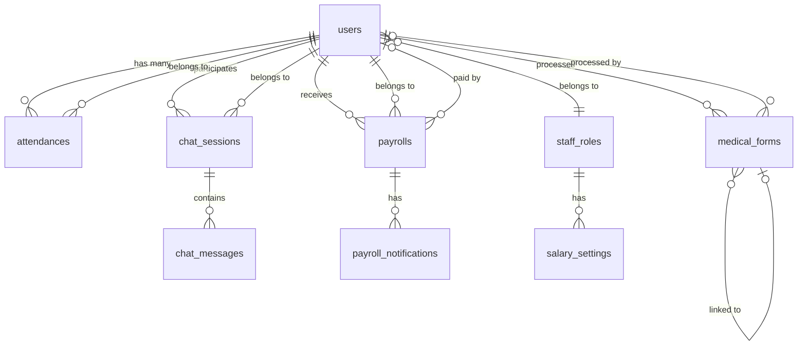

# EMS-IME Website - Dokumentasi Lengkap

> **Versi**: 1.0  
> **Terakhir Diperbarui**: 16 Januari 2026  
> **Developer**: ZAKI TRI PAMUNGKAS  
> **Framework**: Laravel 12 + Livewire 3

---

## 📋 Daftar Isi

1. [Gambaran Umum Sistem](#gambaran-umum-sistem)
2. [Teknologi Stack](#teknologi-stack)
3. [Arsitektur Sistem](#arsitektur-sistem)
4. [Fitur & Modul](#fitur--modul)
5. [Skema Database](#skema-database)
6. [Struktur Kode](#struktur-kode)
7. [API Routes & Endpoints](#api-routes--endpoints)
8. [Instalasi & Setup](#instalasi--setup)
9. [Deployment Guide](#deployment-guide)
10. [Troubleshooting](#troubleshooting)

---

## 🎯 Gambaran Umum Sistem

**EMS-IME** adalah sistem manajemen staf rumah sakit berbasis web yang dibangun untuk **Emergency Medical Services Indonesia Medic Roleplay**. Sistem ini mengelola berbagai aspek operasional rumah sakit roleplay termasuk manajemen staf, absensi, penggajian, formulir medis, live chat, feedback, dan struktur organisasi.

### Tujuan Sistem
- Mengelola data staf medis (Trainee, Perawat, Co-Ass, Dokter Umum, Dokter Spesialis)
- Tracking absensi real-time dengan duty timer
- Sistem penggajian otomatis berbasis jam kerja
- Portal formulir medis publik (Surat Kesehatan, Tes Psikologi, Operasi Plastik, dll)
- Live chat antara pasien dan staf medis
- Sistem feedback dan laporan
- Manajemen struktur organisasi rumah sakit

### Rumah Sakit yang Didukung
1. **Alta Hospital** (default)
2. **Roxwood Hospital**

---

## 🛠️ Teknologi Stack

### Backend
- **Framework**: Laravel 12.x (PHP 8.2+)
- **Database**: SQLite (development), MySQL/MariaDB compatible
- **Authentication**: Laravel Built-in Auth
- **Queue**: Database Queue Driver
- **Cache**: Database Cache Driver
- **Session**: Database Session Storage

### Frontend
- **CSS Framework**: Tailwind CSS 3.4.15
- **JavaScript**: Vanilla JS + Alpine.js (via Livewire)
- **Real-time**: Livewire 3.7 (AJAX + WebSocket)
- **Icons**: Custom SVG Icons

### Dependencies Utama
```json
{
  "laravel/framework": "^12.0",
  "livewire/livewire": "^3.7",
  "irazasyed/telegram-bot-sdk": "^3.15",
  "tailwindcss": "^3.4.15"
}
```

### Build Tools
- **CSS Processing**: Tailwind CLI
- **Package Manager**: Composer (PHP), NPM (Node.js)

---

## 🏗️ Arsitektur Sistem

### Design Pattern
- **MVC (Model-View-Controller)**: Arsitektur utama Laravel
- **Repository Pattern**: Tidak digunakan (menggunakan Eloquent ORM langsung)
- **Service Layer**: Helper classes untuk logika bisnis kompleks
- **Observer Pattern**: Model events untuk cache invalidation

### Struktur Folder

```
public_html/
├── app/
│   ├── Http/Controllers/        # Controllers
│   │   ├── Admin/               # Admin-specific controllers
│   │   ├── Staff/               # Staff-specific controllers
│   │   ├── DashboardController.php
│   │   ├── PublicController.php
│   │   └── StaffController.php
│   ├── Models/                  # Eloquent Models (17 models)
│   ├── Livewire/                # Livewire Components
│   ├── Helpers/                 # Helper classes
│   └── Console/Commands/        # Artisan commands
├── database/
│   ├── migrations/              # 44 migration files
│   └── seeders/                 # Database seeders
├── resources/
│   ├── views/                   # Blade templates
│   │   ├── admin/               # Admin interface
│   │   ├── staff/               # Staff dashboard
│   │   ├── public/              # Public forms
│   │   └── livewire/            # Livewire views
│   └── css/                     # Tailwind CSS
├── routes/
│   ├── web.php                  # Web routes (301 lines)
│   ├── api.php                  # API routes
│   └── console.php              # Artisan routes
├── public/                      # Public assets
└── storage/                     # File storage
```

### Database Schema Overview

**17 Tabel Utama:**

1. **users** - Data pengguna/staf
2. **staff_roles** - Role staf (Trainee, Perawat, Co-Ass, dll)
3. **attendances** - Absensi & clock in/out
4. **payrolls** - Data penggajian
5. **payroll_notifications** - Notifikasi gaji
6. **payroll_exports** - Riwayat export gaji
7. **salary_settings** - Pengaturan gaji per role
8. **medical_forms** - Formulir medis publik
9. **feedback** - Feedback & laporan
10. **chat_sessions** - Sesi chat
11. **chat_messages** - Pesan chat
12. **organizational_structures** - Struktur organisasi
13. **telegram_settings** - Konfigurasi bot Telegram
14. **user_rename_batches** - Batch rename user
15. **user_wrapped_views** - Year in review tracking
16. **sessions** - Session management
17. **cache** - Application cache

---

## ⚡ Fitur & Modul

### 1. Authentication & Authorization

#### Sistem Login
- **Multi-hospital support**: Alta & Roxwood
- **Role-based access**: Admin, Dokter Spesialis, Dokter Umum, Co-Ass, Perawat, Trainee
- **Permission system**: Custom permissions per user & role
- **Account activation**: Manual activation oleh admin

#### Permissions
```php
// Available Permissions
'view_reports'             // Lihat laporan
'manage_users'             // Kelola user/staf
'manage_forms'             // Kelola formulir medis
'manage_attendance_advanced'  // Edit/hapus absensi
'manage_payroll'           // Kelola penggajian
'access_live_chat'         // Akses live chat
'access_feedback'          // Akses feedback
```

**Model**: `User.php`, `StaffRole.php`  
**Controllers**: `StaffController.php`, `Admin/RolePermissionController.php`  
**Middleware**: `auth`, `staff`, `permission`, `admin`

---

### 2. Staff Management

#### Fitur
- ✅ CRUD staf (Create, Read, Update, Delete)
- ✅ Import/Export data staf (Excel/CSV)
- ✅ Filter staf berdasarkan role, hospital, status
- ✅ Aktivasi/deaktivasi akun
- ✅ Reset password
- ✅ Custom salary per user
- ✅ Custom permissions per user
- ✅ Profile image upload
- ✅ Staff ID unik

#### Role Hierarchy (berdasarkan level)
1. **Admin** (level: null) - Full access
2. **Dokter Spesialis** (level: 4)
3. **Dokter Umum** (level: 3)
4. **Co-Ass** (level: 2)
5. **Perawat** (level: 1)
6. **Trainee** (level: 0)

**Files**:
- Controller: `Admin/StaffManagementController.php`
- Model: `User.php`, `StaffRole.php`
- Views: `resources/views/admin/staff/`

---

### 3. Attendance System (Absensi)

#### Fitur Utama
- ✅ **Clock In/Out** real-time
- ✅ **Multi-session per day** (sesi 1, 2, 3, dst)
- ✅ **Duty Timer** - Set durasi tugas otomatis
- ✅ **Auto checkout** saat duty timer habis
- ✅ **Manual checkout** sebelum timer habis
- ✅ **Cross-day session handling** - Split otomatis jika melewati tengah malam
- ✅ **Cross-week session handling** - Split otomatis jika melewati minggu
- ✅ **Session validation** - Validasi konsistensi data
- ✅ **Force checkout** oleh admin
- ✅ **Manual attendance entry** oleh admin
- ✅ **Edit/Delete attendance** oleh admin

#### Status Tracking
- `working` - Sedang tugas normal
- `meeting` - Sedang meeting/training

#### Session Types
- `regular` - Sesi kerja biasa
- `overtime` - Lembur (tidak digunakan saat ini)

#### Duty Timer Logic
1. **Normal Clock In**: Tanpa timer, durasi dihitung saat clock out
2. **Clock In dengan Timer**: 
   - Set durasi (misal: 60 menit)
   - Auto checkout setelah 60 menit dengan durasi = 60 menit
   - Manual checkout sebelum 60 menit = durasi actual elapsed time

#### Data Calculation
- **session_duration**: Durasi dalam detik (akurat)
- **total_hours**: Durasi dalam menit (backward compatibility)
- **Formatted**: HH:MM:SS untuk display

**Files**:
- Model: `Attendance.php` (1115 lines - model terbesar)
- Controller: `DashboardController.php`, `Admin/AttendanceReportController.php`
- Command: `app/Console/Commands/CheckExpiredSessions.php`
- Cron: `/cron/check-expired-sessions` endpoint

---

### 4. Payroll System (Penggajian)

#### Fitur
- ✅ **Automatic generation** - Generate gaji per minggu
- ✅ **Weekly periods** - Senin-Minggu
- ✅ **Hour-based calculation** - Gaji = total jam × base salary
- ✅ **Custom salary** - Override gaji per user
- ✅ **Status tracking**: Pending, Paid, Cancelled
- ✅ **Export to Excel/CSV**
- ✅ **Duplicate detection & removal**
- ✅ **Payroll notifications** - Notif ke staf
- ✅ **Regenerate payroll** - Recalculate jika ada kesalahan

#### Salary Settings
Menggunakan tabel `salary_settings` dengan field:
- `role_id` - Role staf
- `hospital` - Alta atau Roxwood
- `weekly_salary` - Gaji mingguan base
- `is_active` - Status aktif

#### Calculation Formula
```php
// Base Calculation
$totalHours = sum(attendances.session_duration) / 3600; // Convert to hours
$baseSalary = user.custom_salary ?? salary_settings.weekly_salary;
$calculatedSalary = $totalHours * $baseSalary;

// Example:
// Total work: 40 hours
// Base salary: $1000/week
// Calculated: 40 × $1000 = $40,000
```

#### Payroll Generation Flow
1. Admin klik "Generate Payroll" untuk periode tertentu
2. System ambil semua staf aktif
3. Hitung total jam kerja per user dari attendances
4. Kalkulasi gaji berdasarkan formula
5. Create record payroll dengan status "pending"
6. Send notification ke setiap staf

**Files**:
- Model: `Payroll.php`, `PayrollNotification.php`, `SalarySetting.php`
- Controller: `Admin/PayrollController.php`, `Staff/PayrollController.php`
- Helper: `app/Helpers/PayrollHelper.php`
- Views: `resources/views/admin/payroll/`, `resources/views/staff/payroll/`

---

### 5. Medical Forms System

#### Jenis Formulir Publik
1. **Surat Kesehatan** - Medical certificate
2. **Tes Psikologi** - Psychological assessment
3. **Surat Psikolog** - Psychologist letter
4. **Operasi Plastik** - Plastic surgery
5. **Pendaftaran Karakter** - Character registration

#### Fitur
- ✅ Public form submission (tanpa login)
- ✅ Form validation
- ✅ Telegram notification ke staf
- ✅ Approval/Rejection oleh staf authorized
- ✅ Psychology test results & recommendations
- ✅ Testimoni submission
- ✅ Testimoni approval oleh admin
- ✅ Image upload untuk feedback
- ✅ Linked forms (e.g., tes_psikologi → surat_psikolog)

#### Form Workflow
1. User isi formulir di website
2. Submit → Telegram notification ke staf
3. Staf review di dashboard
4. Approve/Reject dengan catatan
5. User lihat hasil di success page
6. (Opsional) User submit testimoni

**Files**:
- Model: `MedicalForm.php`
- Controller: `PublicController.php` (79441 bytes - controller terbesar), `DashboardController.php`
- Views: `resources/views/public/forms/`
- Routes: `/form/{type}`, `/form/submit`, `/form/success/{id}`

---

### 6. Live Chat System

#### Fitur
- ✅ **Real-time chat** menggunakan Livewire
- ✅ **Multi-session support** - Chat dengan banyak user
- ✅ **File attachments** - Upload gambar/dokumen
- ✅ **Read status tracking** - Admin & user read status
- ✅ **Pagination** - Load lebih banyak pesan
- ✅ **Auto-scroll** ke pesan terbaru
- ✅ **Permission-based access** - Hanya staf dengan permission bisa reply

#### Chat Components
- **User Side**: `/chat` - User view chat mereka
- **Admin Side**: `/admin/chat` - Admin view semua chat sessions

**Files**:
- Model: `ChatSession.php`, `ChatMessage.php`
- Livewire: `app/Livewire/AdminChat.php`, `app/Livewire/UserChat.php`
- Views: `resources/views/livewire/admin-chat.blade.php`, `resources/views/chat/`

---

### 7. Feedback & Reporting System

#### Tipe Feedback
- **Laporan** (Report/Kritik)
- **Masukan** (Suggestion/Saran)

#### Fitur
- ✅ Submit feedback dengan/tanpa akun
- ✅ Upload image sebagai bukti
- ✅ Status tracking: New, In Progress, Resolved
- ✅ Admin dashboard untuk manage feedback
- ✅ Filter berdasarkan type & status

**Files**:
- Model: `Feedback.php`
- Controller: `PublicController.php`
- Views: `resources/views/admin/feedback/`, `resources/views/feedback/`

---

### 8. Organizational Structure

#### Fitur
- ✅ Manage struktur organisasi EMS & Roxwood
- ✅ CRUD positions (jabatan)
- ✅ Assign staff ke posisi
- ✅ Multiple versions support
- ✅ Activate/deactivate versions
- ✅ Public display di `/struktural-ems`

#### Struktur
```php
organizational_structures:
  - name: "Struktur EMS 2026"
  - hospital: "alta" | "roxwood"
  - is_active: true/false
  - positions: JSON array
    [
      {
        "title": "Direktur Utama",
        "user_id": 1,
        "order": 1
      },
      ...
    ]
```

**Files**:
- Model: `OrganizationalStructure.php`
- Controller: `Admin/OrganizationalStructureController.php`
- Views: `resources/views/admin/organizational-structure/`, `resources/views/public/struktural-ems.blade.php`

---

### 9. Wrapped Feature (Year in Review)

#### Fitur
- ✅ Statistik tahunan staf (jam kerja, sesi, dll)
- ✅ Achievements & milestones
- ✅ View tracking (user sudah lihat atau belum)
- ✅ Dismiss notification

**Files**:
- Model: `UserWrappedView.php`
- Controller: `WrappedController.php`
- Views: `resources/views/wrapped/`

---

### 10. Telegram Bot Integration

#### Fitur
- ✅ Notifikasi formulir baru
- ✅ Configurable bot token & chat ID
- ✅ Test notification
- ✅ Settings management

**Files**:
- Model: `TelegramSetting.php`
- Controller: `Admin/TelegramSettingController.php`
- Service: `app/Services/TelegramService.php`

---

## 💾 Skema Database

### Core Tables

#### `users`
```sql
- id (PK)
- name VARCHAR
- email VARCHAR UNIQUE
- password VARCHAR
- role_id FK → staff_roles
- staff_id VARCHAR UNIQUE
- hospital ENUM('alta', 'roxwood')
- is_active BOOLEAN
- profile_image VARCHAR
- custom_permissions JSON
- custom_salary DECIMAL
- status ENUM('working', 'meeting')
- created_at, updated_at
```

#### `staff_roles`
```sql
- id (PK)
- name VARCHAR UNIQUE (admin, dokter_spesialis, dokter_umum, co_ass, perawat, trainee)
- display_name VARCHAR
- level INT (0-4, higher = more authority)
- permissions JSON
- created_at, updated_at
```

#### `attendances`
```sql
- id (PK)
- user_id FK → users
- clock_in DATETIME
- clock_out DATETIME
- total_hours INT (minutes - legacy)
- session_duration INT (seconds - accurate)
- work_date DATE
- session_number INT
- session_type ENUM('regular', 'overtime')
- is_active BOOLEAN
- scheduled_duty_minutes INT
- scheduled_end_time DATETIME
- auto_checked_out BOOLEAN
- notes TEXT
- created_at, updated_at
```

#### `payrolls`
```sql
- id (PK)
- user_id FK → users
- period_start DATE
- period_end DATE
- total_hours DECIMAL
- base_salary INT
- calculated_salary INT
- status ENUM('pending', 'paid', 'cancelled')
- paid_at DATETIME
- paid_by FK → users
- notes TEXT
- created_at, updated_at
```

#### `medical_forms`
```sql
- id (PK)
- type ENUM('surat_kesehatan', 'tes_psikologi', 'surat_psikolog', 'operasi_plastik', 'pendaftaran_karakter')
- name VARCHAR
- age INT
- status ENUM('pending', 'approved', 'rejected')
- data JSON (form-specific fields)
- processed_by FK → users
- processed_at DATETIME
- hospital ENUM('alta', 'roxwood')
- linked_form_id FK → medical_forms (for surat_psikolog linked to tes_psikologi)
- testimoni fields...
- created_at, updated_at
```

### Relationship Diagram



---

## 📁 Struktur Kode

### Controllers

#### Public Controllers
- **PublicController.php** (79KB) - Handle semua public routes (forms, appointments, feedback)

#### Dashboard Controllers
- **DashboardController.php** (30KB) - Staff dashboard, clock in/out, forms approval

#### Staff Controllers
- **StaffController.php** - Auth (login, register, logout), profile

#### Admin Controllers
- **Admin/StaffManagementController.php** - CRUD staf
- **Admin/PayrollController.php** - Payroll management
- **Admin/SalarySettingController.php** - Salary settings
- **Admin/AttendanceReportController.php** - Attendance reports & management
- **Admin/OrganizationalStructureController.php** - Org structure
- **Admin/RolePermissionController.php** - Role permissions
- **Admin/TelegramSettingController.php** - Telegram config

### Models (17 Total)

**Core Models:**
1. **User.php** (337 lines) - User model dengan permissions, hospital scopes
2. **Attendance.php** (1115 lines) - Model terbesar, handle clock in/out, splitting, validation
3. **Payroll.php** (244 lines) - Payroll calculation & status
4. **MedicalForm.php** - Medical forms
5. **StaffRole.php** - Roles & permissions
6. **SalarySetting.php** - Salary configurations

**Supporting Models:**
7. PayrollNotification.php
8. PayrollExport.php
9. Feedback.php
10. ChatSession.php
11. ChatMessage.php
12. OrganizationalStructure.php
13. TelegramSetting.php
14. UserRenameBatch.php
15. UserRenameLog.php
16. UserWrappedView.php
17. Absensi.php (legacy)

### Helpers

- **TimeHelper.php** - Format duration, convert seconds to hours
- **PayrollHelper.php** - Format currency, calculate salary

### Livewire Components

- **AdminChat.php** - Real-time admin chat
- **UserChat.php** - Real-time user chat
- **Other components** - Form wizards, modals

### Migrations (44 Total)

Migration terakhir: `2026_01_16_140656_create_payroll_exports_table.php`

---

## 🔌 API Routes & Endpoints

### Public Routes

```php
GET  /                              → Landing page
GET  /form/{type}                   → Formulir medis
POST /form/submit                   → Submit formulir
GET  /form/success/{id}             → Hasil formulir
POST /form/testimoni/{id}           → Submit testimoni
GET  /struktural-ems                → Struktur organisasi
GET  /sitemap.xml                   → SEO sitemap
```

### Authentication Routes

```php
GET  /login                         → Redirect ke /staff/login
GET  /staff/login                   → Login form
POST /staff/login                   → Process login
GET  /staff/register                → Register form
POST /staff/register                → Process register
POST /staff/logout                  → Logout
```

### Staff Dashboard Routes

```php
GET  /staff/dashboard               → Staff dashboard
GET  /staff/profile                 → Profile page
POST /staff/profile                 → Update profile
POST /staff/profile/update-email    → Update email

// Attendance
POST /staff/attendance/clock-in     → Clock in
POST /staff/attendance/clock-out    → Clock out

// Forms
GET  /staff/forms                   → List forms
GET  /staff/forms/{id}              → Form detail
POST /staff/forms/{id}/approve      → Approve form
POST /staff/forms/{id}/reject       → Reject form
POST /staff/forms/{id}/testimoni/approve → Approve testimoni

// Payroll (Staff View)
GET  /staff/payroll                 → Payroll list
GET  /staff/payroll/{id}            → Payroll detail
GET  /staff/payroll/stats           → Payroll statistics
POST /staff/payroll/notifications/{notification}/mark-read → Mark notification read

// Wrapped
GET  /wrapped/{year}                → Year in review
POST /wrapped/dismiss               → Dismiss wrapped
```

### Admin Routes (prefix: `/admin`)

```php
GET  /admin/dashboard               → Admin dashboard [permission:view_reports]

// Staff Management [permission:manage_users]
GET    /admin/staff                 → List staf
GET    /admin/staff/create          → Create form
POST   /admin/staff                 → Store staf
GET    /admin/staff/{user}/edit     → Edit form
PUT    /admin/staff/{user}          → Update staf
DELETE /admin/staff/{user}          → Delete staf
GET    /admin/staff/export          → Export Excel
POST   /admin/staff/{user}/toggle-active → Activate/deactivate
POST   /admin/staff/{user}/reset-password → Reset password

// Attendance Reports [permission:view_reports]
GET    /admin/attendance-reports    → Attendance list
GET    /admin/attendance-reports/stats → Statistics
POST   /admin/attendance-reports/force-checkout → Force checkout [permission:manage_attendance_advanced]
POST   /admin/attendance-reports/manual → Manual entry [permission:manage_attendance_advanced]
PUT    /admin/attendance-reports/{id} → Update attendance [permission:manage_attendance_advanced]
DELETE /admin/attendance-reports/{id} → Delete attendance [permission:manage_attendance_advanced]

// Payroll Management [permission:manage_payroll]
GET    /admin/payroll               → Payroll list
GET    /admin/payroll/export        → Export payroll
POST   /admin/payroll/generate      → Generate new payroll
POST   /admin/payroll/remove-duplicates → Remove duplicates
GET    /admin/payroll/{payroll}     → Payroll detail
POST   /admin/payroll/{payroll}/mark-paid → Mark as paid
POST   /admin/payroll/{payroll}/cancel → Cancel payroll
DELETE /admin/payroll/{payroll}     → Delete payroll
POST   /admin/payroll/{payroll}/regenerate → Regenerate single
POST   /admin/payroll/regenerate-week → Regenerate whole week

// Salary Settings [permission:manage_payroll]
Resource: /admin/salary-settings (index, create, store, edit, update, destroy)
POST   /admin/salary-settings/bulk-create → Bulk create
POST   /admin/salary-settings/{setting}/toggle-status → Activate/deactivate

// Organizational Structure [admin only]
Resource: /admin/organizational-structure
POST   /admin/organizational-structure/{id}/activate → Activate version
GET    /admin/organizational-structure/{id}/edit-names → Edit names form
PUT    /admin/organizational-structure/{id}/update-names → Update names

// Chat [permission:access_live_chat]
GET    /admin/chat                  → Live chat dashboard

// Feedback [permission:access_feedback]
GET    /admin/feedback              → Feedback list

// Role Permissions [admin only]
GET    /admin/roles/permissions     → Permission management
POST   /admin/roles/{role}/toggle-permission → Toggle role permission
POST   /admin/users/{user}/toggle-chat-permission → Toggle user chat permission

// Telegram [admin only]
GET    /admin/telegram              → Telegram settings
PUT    /admin/telegram              → Update settings
POST   /admin/telegram/test         → Test notification
```

### System Routes

```php
GET  /test                          → Health check
GET  /clear-cache                   → Clear all caches
GET  /csrf-token                    → Get CSRF token

// Cron/Scheduler
GET  /cron/check-expired-sessions   → Auto checkout expired sessions
```

---

## 🚀 Instalasi & Setup

### Requirements

- **PHP**: 8.2 atau lebih tinggi
- **Composer**: Latest version
- **Node.js**: 18+ dan NPM
- **Database**: SQLite (dev) atau MySQL/MariaDB (production)
- **Web Server**: Apache/Nginx dengan mod_rewrite

### Step-by-Step Installation

#### 1. Clone Repository

```bash
git clone <repository-url> ems-ime
cd ems-ime/public_html
```

#### 2. Install Dependencies

```bash
# Install PHP dependencies
composer install

# Install Node dependencies
npm install
```

#### 3. Environment Configuration

```bash
# Copy environment file
cp .env.example .env

# Generate application key
php artisan key:generate
```

#### 4. Configure `.env`

```env
APP_NAME="EMS-IME"
APP_ENV=production
APP_DEBUG=false
APP_URL=https://your-domain.com

# Database (SQLite)
DB_CONNECTION=sqlite

# Or MySQL
# DB_CONNECTION=mysql
# DB_HOST=127.0.0.1
# DB_PORT=3306
# DB_DATABASE=ems_ime
# DB_USERNAME=root
# DB_PASSWORD=

# Mail (jika diperlukan)
MAIL_MAILER=smtp
MAIL_HOST=smtp.mailtrap.io
MAIL_PORT=2525
MAIL_USERNAME=null
MAIL_PASSWORD=null

# Queue & Cache
QUEUE_CONNECTION=database
CACHE_STORE=database
SESSION_DRIVER=database

# Telegram (opsional)
TELEGRAM_BOT_TOKEN=
TELEGRAM_CHAT_ID=

# Scheduler Token (untuk cron)
SCHEDULER_TOKEN=your-secret-token-here
```

#### 5. Database Setup

```bash
# Create SQLite database
touch database/database.sqlite

# Or create MySQL database
mysql -u root -p
CREATE DATABASE ems_ime CHARACTER SET utf8mb4 COLLATE utf8mb4_unicode_ci;

# Run migrations
php artisan migrate

# Seed database with default data
php artisan db:seed
```

Default seeders akan membuat:
- Admin user (customize di `AdminUserSeeder.php`)
- Staff roles (Trainee → Dokter Spesialis)
- Salary settings untuk semua role
- Organizational structure template

#### 6. Storage Setup

```bash
# Create storage link
php artisan storage:link

# Set permissions
chmod -R 775 storage bootstrap/cache
```

#### 7. Build Assets

```bash
# Development
npm run dev

# Production
npm run build
```

#### 8. Start Development Server

```bash
# Method 1: PHP built-in server
php artisan serve

# Method 2: Composer script (with queue, logs, vite)
composer run dev

# Access at: http://localhost:8000
```

### Default Admin Login

Setelah seeding, login menggunakan:
- **Email**: (check `database/seeders/AdminUserSeeder.php`)
- **Password**: (check `database/seeders/AdminUserSeeder.php`)

### Post-Installation

1. **Update Admin Profile**
   - Login sebagai admin
   - Update profile, email, password

2. **Configure Salary Settings**
   - Go to `/admin/salary-settings`
   - Set salary untuk setiap role & hospital

3. **Setup Telegram** (opsional)
   - Go to `/admin/telegram`
   - Add bot token & chat ID
   - Test notification

4. **Create Staff Users**
   - Go to `/admin/staff`
   - Add staff atau gunakan `/staff/register`

---

## 🌐 Deployment Guide

### Shared Hosting Deployment

#### 1. Persiapan File

```bash
# Build production assets
npm run build

# Optimize autoloader
composer install --optimize-autoloader --no-dev

# Cache configuration
php artisan config:cache
php artisan route:cache
php artisan view:cache
```

#### 2. Upload Files

Upload semua file KECUALI:
- `node_modules/`
- `.git/`
- `tests/`
- `.env` (akan dibuat manual)

#### 3. Setup .htaccess

Pastikan `.htaccess` di root folder:

```apache
<IfModule mod_rewrite.c>
    RewriteEngine On
    RewriteRule ^(.*)$ public/$1 [L]
</IfModule>
```

Dan `.htaccess` di `public/`:

```apache
<IfModule mod_rewrite.c>
    RewriteEngine On
    RewriteCond %{REQUEST_FILENAME} !-d
    RewriteCond %{REQUEST_FILENAME} !-f
    RewriteRule ^ index.php [L]
</IfModule>
```

#### 4. Configure Database

Di cPanel/Hosting:
1. Create MySQL database
2. Create user & grant privileges
3. Update `.env` dengan credentials

#### 5. Run Migrations

Via SSH atau Terminal di cPanel:
```bash
php artisan migrate --force
php artisan db:seed --force
```

#### 6. Set Permissions

```bash
chmod -R 775 storage
chmod -R 775 bootstrap/cache
```

#### 7. Setup Cron Job

Add cron job untuk auto checkout:

```cron
# Every 5 minutes
*/5 * * * * curl -s https://your-domain.com/cron/check-expired-sessions?token=your-secret-token-here
```

Atau menggunakan Laravel scheduler:
```cron
* * * * * cd /path-to-your-project && php artisan schedule:run >> /dev/null 2>&1
```

### VPS/Dedicated Server Deployment

#### 1. Server Setup (Ubuntu)

```bash
# Update system
sudo apt update && sudo apt upgrade -y

# Install PHP 8.2
sudo apt install php8.2 php8.2-fpm php8.2-mysql php8.2-sqlite3 php8.2-mbstring php8.2-xml php8.2-curl php8.2-zip

# Install Composer
curl -sS https://getcomposer.org/installer | php
sudo mv composer.phar /usr/local/bin/composer

# Install Node.js
curl -fsSL https://deb.nodesource.com/setup_18.x | sudo -E bash -
sudo apt install -y nodejs

# Install Nginx
sudo apt install nginx

# Install MySQL (jika diperlukan)
sudo apt install mysql-server
```

#### 2. Nginx Configuration

Create file `/etc/nginx/sites-available/ems-ime`:

```nginx
server {
    listen 80;
    server_name your-domain.com;
    root /var/www/ems-ime/public_html/public;

    add_header X-Frame-Options "SAMEORIGIN";
    add_header X-Content-Type-Options "nosniff";

    index index.php;

    charset utf-8;

    location / {
        try_files $uri $uri/ /index.php?$query_string;
    }

    location = /favicon.ico { access_log off; log_not_found off; }
    location = /robots.txt  { access_log off; log_not_found off; }

    error_page 404 /index.php;

    location ~ \.php$ {
        fastcgi_pass unix:/var/run/php/php8.2-fpm.sock;
        fastcgi_param SCRIPT_FILENAME $realpath_root$fastcgi_script_name;
        include fastcgi_params;
    }

    location ~ /\.(?!well-known).* {
        deny all;
    }
}
```

Enable site:
```bash
sudo ln -s /etc/nginx/sites-available/ems-ime /etc/nginx/sites-enabled/
sudo nginx -t
sudo systemctl restart nginx
```

#### 3. SSL with Let's Encrypt

```bash
sudo apt install certbot python3-certbot-nginx
sudo certbot --nginx -d your-domain.com
```

#### 4. Setup Queue Worker

Create systemd service `/etc/systemd/system/ems-queue.service`:

```ini
[Unit]
Description=EMS-IME Queue Worker
After=network.target

[Service]
Type=simple
User=www-data
WorkingDirectory=/var/www/ems-ime/public_html
ExecStart=/usr/bin/php /var/www/ems-ime/public_html/artisan queue:work --sleep=3 --tries=3
Restart=always

[Install]
WantedBy=multi-user.target
```

Enable and start:
```bash
sudo systemctl enable ems-queue
sudo systemctl start ems-queue
```

#### 5. Setup Cron

```bash
sudo crontab -e -u www-data
```

Add:
```cron
* * * * * cd /var/www/ems-ime/public_html && php artisan schedule:run >> /dev/null 2>&1
```

---

## 🔧 Troubleshooting

### Common Issues

#### 1. "Class not found" Error

**Solusi**:
```bash
composer dump-autoload
php artisan config:clear
php artisan cache:clear
```

#### 2. Permission Denied Errors

**Solusi**:
```bash
sudo chown -R www-data:www-data storage bootstrap/cache
sudo chmod -R 775 storage bootstrap/cache
```

#### 3. 500 Internal Server Error

**Check**:
- `.env` file exists
- `APP_KEY` is generated
- Database credentials correct
- Check Laravel logs: `storage/logs/laravel.log`

#### 4. Assets Not Loading

**Solusi**:
```bash
npm run build
php artisan view:clear
```

#### 5. Auto Checkout Not Working

**Check**:
- Cron job configured correctly
- `SCHEDULER_TOKEN` in `.env`
- Test manually: `/cron/check-expired-sessions?token=YOUR_TOKEN`

#### 6. Payroll Tidak Generate

**Debug**:
```bash
php artisan tinker
>>> $user = \App\Models\User::find(1);
>>> $attendances = $user->attendances()->whereBetween('work_date', ['2026-01-06', '2026-01-12'])->get();
>>> $totalSeconds = $attendances->sum('session_duration');
>>> $totalHours = $totalSeconds / 3600;
```

#### 7. Chat Not Real-time

**Check**:
- Livewire scripts loaded
- No JavaScript errors in console
- Browser cache cleared

---

## 📊 Maintenance & Monitoring

### Regular Maintenance Tasks

#### Daily
- Monitor error logs: `storage/logs/laravel.log`
- Check queue status: `php artisan queue:work`

#### Weekly
- Backup database
- Check disk space
- Review payroll generations

#### Monthly
- Update dependencies: `composer update`, `npm update`
- Clean old logs: `php artisan log:clear` (if available)
- Optimize database: `php artisan optimize`

### Backup Strategy

#### Database Backup

```bash
# SQLite
cp database/database.sqlite database/backups/backup-$(date +%Y%m%d).sqlite

# MySQL
mysqldump -u username -p ems_ime > backup-$(date +%Y%m%d).sql
```

#### Full Backup

```bash
tar -czf ems-ime-backup-$(date +%Y%m%d).tar.gz \
  --exclude='node_modules' \
  --exclude='vendor' \
  --exclude='storage/logs/*' \
  /var/www/ems-ime/
```

### Performance Optimization

```bash
# Cache everything
php artisan config:cache
php artisan route:cache
php artisan view:cache
php artisan event:cache

# Optimize Composer autoloader
composer install --optimize-autoloader --no-dev

# Enable OPcache (php.ini)
opcache.enable=1
opcache.memory_consumption=256
opcache.max_accelerated_files=20000
```

---

## 📝 Development Notes

### Git History Highlights

**Total Commits**: 156 (sejak 2025-01-01)
**Commit Terakhir**: fix: remove unused code for validation errors
**Developer**: ZAKI TRI PAMUNGKAS

**Major Updates**:
- Character registration forms
- Robust validation system
- Toast notification system
- UI refinements
- Payroll export feature
- Account activation flow
- Attendance status tracking
- Cross-day/cross-week session handling

### Coding Standards

- **PSR-12** PHP coding standard
- **Blade** templating for views
- **Tailwind CSS** utility classes
- **Alpine.js** for simple interactivity
- **Livewire** for reactive components

### Testing

```bash
# Run tests
php artisan test

# Run specific test
php artisan test --filter=UserTest
```

---

## 🔐 Security Considerations

### Implemented Security

✅ CSRF Protection (Laravel default)  
✅ SQL Injection Prevention (Eloquent ORM)  
✅ XSS Protection (Blade escaping)  
✅ Password Hashing (bcrypt)  
✅ Route Middleware (auth, permission)  
✅ Input Validation  
✅ Rate Limiting (throttle)  

### Recommended Practices

1. **Keep Laravel Updated**: `composer update laravel/framework`
2. **Use HTTPS**: Enable SSL certificate
3. **Strong Passwords**: Enforce minimum 8 characters
4. **Regular Backups**: Automated daily backups
5. **Monitor Logs**: Check for suspicious activity
6. **API Rate Limiting**: Already configured in routes

---

## 📞 Support & Contact

Untuk pertanyaan atau masalah, hubungi developer:

**Developer**: ZAKI TRI PAMUNGKAS  
**Role**: Full Stack Developer  
**Project**: EMS-IME (Emergency Medical Services Indonesia Medic Roleplay)

---

## 📜 License

Proprietary - EMS Indonesia Medic Roleplay

---

**Dokumentasi Versi**: 1.0  
**Terakhir Diperbarui**: 16 Januari 2026  
**Generated by**: Automated Documentation System
