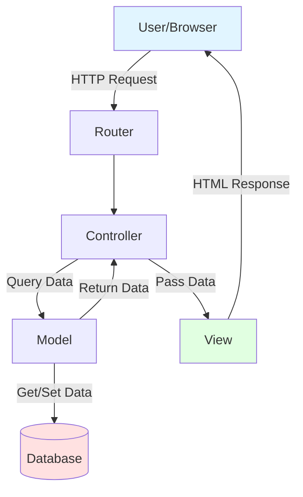
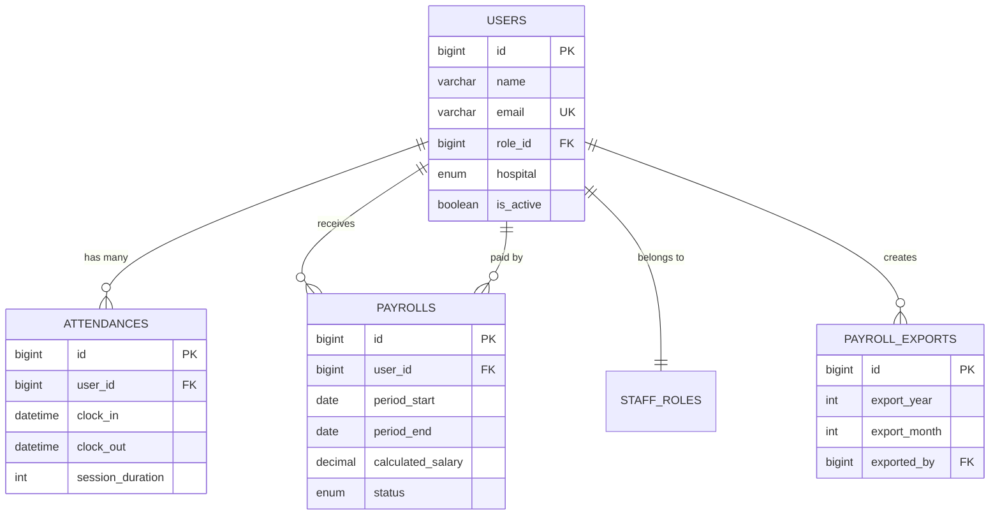

# 📚 Portal Medis iMe Roleplay - Dokumentasi Lengkap

> **Sistem Manajemen Medis Terintegrasi untuk Komunitas Roleplay**  
> Versi: 1.0 | Last Updated: 16 Januari 2026

---

## 📖 Daftar Isi

- [1. Pengenalan](#1-pengenalan)
  - [1.1 Apa itu Portal Medis iMe?](#11-apa-itu-portal-medis-ime)
  - [1.2 Untuk Siapa Sistem Ini?](#12-untuk-siapa-sistem-ini)
  - [1.3 Fitur Utama](#13-fitur-utama)
- [2. Teknologi yang Digunakan](#2-teknologi-yang-digunakan)
- [3. Struktur Project](#3-struktur-project)
- [4. Instalasi & Setup](#4-instalasi--setup)
- [5. Panduan Pengguna](#5-panduan-pengguna)
- [6. Panduan Developer](#6-panduan-developer)
- [7. Database Schema](#7-database-schema)
- [8. API & Routes](#8-api--routes)
- [9. Troubleshooting](#9-troubleshooting)
- [10. FAQ](#10-faq)

---

## 1. Pengenalan

### 1.1 Apa itu Portal Medis iMe?

**Portal Medis iMe Roleplay** adalah sistem web-based yang dirancang khusus untuk mengelola operasional medis dalam komunitas roleplay. Sistem ini mengintegrasikan berbagai aspek manajemen seperti:

- 📋 **Manajemen Staff** - Kelola data karyawan medis
- ⏰ **Absensi & Kehadiran** - Tracking jam kerja real-time  
- 💰 **Payroll** - Perhitungan gaji otomatis
- 📝 **Formulir Medis** - Tes psikologi, surat keterangan
- 💬 **Live Chat** - Komunikasi internal
- 📊 **Pelaporan** - Dashboard & analytics
- 🎉 **Year Wrapped** - Rekap tahunan personal

**Analogi Sederhana (untuk Orang Awam):**  
Bayangkan sistem ini seperti WhatsApp + Excel + Kasir yang digabung jadi satu - tapi khusus untuk rumah sakit roleplay. Staff bisa absen, ngechat, lihat gaji, dan semua data tercatat otomatis!

---

### 1.2 Untuk Siapa Sistem Ini?

#### 👥 **Target Pengguna:**

1. **🏥 Staff Medis**
   - Trainee, Perawat, Dokter, Paramedik
   - Bisa absen, lihat gaji, isi formulir
   
2. **👔 Management/Admin**
   - Direktur, HRD, Supervisor
   - Kelola staff, approve form, export data
   
3. **💻 Developer/Programmer**
   - Maintain sistem, tambah fitur, fix bugs

4. **📱 Public/Pasien** (Limited Access)
   - Isi formulir medis online
   - Lihat informasi layanan

---

### 1.3 Fitur Utama

| Fitur | Penjelasan Awam | Penjelasan Teknis |
|-------|-----------------|-------------------|
| **📝 Registrasi & Login** | Daftar akun baru, login ke sistem | Authentication system dengan role-based access control |
| **⏰ Absensi Digital** | Clock in/out seperti mesin absen kantor | Real-time attendance tracking dengan session duration calculation |
| **💰 Payroll Otomatis** | Gaji dihitung otomatis dari jam kerja | Automated salary calculation based on attendance data + role multipliers |
| **📊 Dashboard** | Lihat ringkasan aktivitas & gaji | Analytics dashboard dengan data visualization |
| **💬 Live Chat** | Chat internal antar staff | Real-time messaging system menggunakan Livewire |
| **📋 Manajemen Staff** | Admin bisa tambah/edit/hapus staff | CRUD operations dengan permission system |
| **📝 Formulir Medis** | Pasien isi form online | Dynamic form builder dengan validation |
| **🎉 Year Wrapped** | Rekap tahunan personal seperti Spotify Wrapped | Personalized annual statistics dengan animated UI |
| **📤 Export Data** | Download data ke Excel/CSV | CSV export dengan monthly restriction |
| **🔔 Notifikasi** | Terima pemberitahuan penting | Push notifications via Telegram Bot |

---

## 2. Teknologi yang Digunakan

### 🛠️ **Tech Stack (Penjelasan Awam)**

Sistem ini dibangun menggunakan berbagai "bahan" digital:

- **🏢 Backend (Otak Sistem)**: Laravel - Seperti "chef" yang mengolah semua data
- **🎨 Frontend (Tampilan)**: HTML, CSS, JavaScript + Tailwind - "Desainer interior" sistem
- **💾 Database (Gudang Data)**: MySQL - "Lemari arsip" digital yang menyimpan semua informasi
- **⚡ Real-time**: Livewire - Membuat halaman update otomatis tanpa refresh
- **📲 Telegram Bot**: Untuk kirim notifikasi ke Telegram

### 💻 **Tech Stack (Technical Details)**

```json
{
  "🔧 Framework": {
    "Backend": "Laravel 12.0",
    "Language": "PHP 8.2+",
    "Real-time": "Livewire 3.7"
  },
  "🎨 Frontend": {
    "CSS Framework": "Tailwind CSS",
    "JavaScript": "Vanilla JS + Alpine.js",
    "Build Tool": "Vite"
  },
  "💾 Database": {
    "DBMS": "MySQL 8.0+",
    "ORM": "Eloquent"
  },
  "📦 Key Dependencies": {
    "Telegram Bot": "irazasyed/telegram-bot-sdk ^3.15",
    "Testing": "PHPUnit ^11.5"
  }
}
```

**System Requirements:**
- PHP >= 8.2
- Composer >= 2.0
- Node.js >= 18.0 & NPM >= 9.0
- MySQL >= 8.0
- Web Server (Apache/Nginx)

---

## 3. Struktur Project

### 📂 **Struktur Folder (Penjelasan Awam)**

```
d:\website\EMS-IME\public_html\
├── 📁 app/                    # Kode program utama (otak sistem)
│   ├── Http/Controllers/      # "Petugas" yang handle permintaan user
│   ├── Models/                # "Blueprint" data (User, Payroll, dll)
│   ├── Helpers/               # Fungsi bantuan (kalkulator gaji, dll)
│   └── Livewire/              # Komponen real-time (chat, dll)
│
├── 📁 database/               # Skrip untuk buat tabel database
│   ├── migrations/            # "Resep" struktur database
│   └── seeders/               # Data awal untuk testing
│
├── 📁 resources/              # File tampilan & aset
│   ├── views/                 # Halaman HTML (yang user lihat)
│   ├── css/                   # Styling (warna, layout)
│   └── js/                    # JavaScript (animasi, interaksi)
│
├── 📁 routes/                 # "Peta jalan" URL sistem
│   ├── web.php                # Route untuk halaman web
│   └── api.php                # Route untuk API
│
├── 📁 public/                 # File yang bisa diakses publik
│   ├── index.php              # Pintu masuk utama
│   └── storage/               # Foto, file upload
│
├── 📁 storage/                # File sistem & cache
│   ├── app/                   # File upload aplikasi
│   └── logs/                  # Log error & aktivitas
│
└── 📁 config/                 # Pengaturan sistem
    ├── database.php           # Setting database
    └── app.php                # Setting aplikasi umum
```

### 🏗️ **Arsitektur Sistem (MVC Pattern)**



**Penjelasan:**
1. **User** membuka halaman (misal: `/admin/payroll`)
2. **Router** cek: "URL ini untuk apa?"
3. **Controller** dijalankan: "Ambil data payroll dari database"
4. **Model** berkomunikasi dengan **Database**: "SELECT * FROM payrolls..."
5. **View** render HTML dengan data tersebut
6. **Browser** tampilkan halaman ke user

---

## 4. Instalasi & Setup

### 🔧 **Panduan Instalasi (Step-by-Step untuk Pemula)**

#### **Langkah 1: Persiapan Environment**

```powershell
# 1. Install XAMPP (sudah include PHP + MySQL)
# Download dari: https://www.apachefriends.org/

# 2. Install Composer (Package manager untuk PHP)
# Download dari: https://getcomposer.org/download/

# 3. Install Node.js (untuk build frontend)
# Download dari: https://nodejs.org/

# 4. Verifikasi instalasi
php -v        # Harus PHP 8.2+
composer -V   # Harus Composer 2.0+
node -v       # Harus Node 18+
npm -v        # Harus NPM 9+
```

#### **Langkah 2: Clone & Install Dependencies**

```powershell
# 1. Masuk ke folder project
cd d:\website\EMS-IME\public_html

# 2. Install PHP dependencies
composer install

# 3. Install JavaScript dependencies  
npm install
```

#### **Langkah 3: Konfigurasi Environment**

```powershell
# 1. Copy file environment
copy .env.example .env

# 2. Generate application key
php artisan key:generate
```

**Edit file `.env`:**
```ini
APP_NAME="Portal Medis iMe"
APP_URL=http://127.0.0.1:8000

# Database Configuration
DB_CONNECTION=mysql
DB_HOST=127.0.0.1
DB_PORT=3306
DB_DATABASE=tepedev      # Nama database Anda
DB_USERNAME=root         # Username MySQL
DB_PASSWORD=            # Password MySQL (kosong jika default)

# Telegram Bot (Optional)
TELEGRAM_BOT_TOKEN=your_bot_token_here
TELEGRAM_ADMIN_CHAT_ID=your_chat_id_here
```

#### **Langkah 4: Setup Database**

```powershell
# 1. Buat database baru di MySQL
# Buka phpMyAdmin: http://localhost/phpmyadmin
# Klik "New" → Nama: "tepedev" → Create

# 2. Jalankan migrations (buat tabel)
php artisan migrate

# 3. (Optional) Isi data dummy untuk testing
php artisan db:seed
```

#### **Langkah 5: Build Assets & Run Server**

```powershell
# Build CSS/JS (development mode)
npm run dev

# Atau build untuk production:
npm run build

# Jalankan server Laravel
php artisan serve

# ✅ Buka browser: http://127.0.0.1:8000
```

---

## 5. Panduan Pengguna

### 👤 **Untuk Staff Medis**

#### **5.1 Cara Login**

1. Buka `http://127.0.0.1:8000/staff/login`
2. Jika belum punya akun, klik **"Register"**
3. Isi form registrasi:
   - Nama lengkap
   - Email
   - Password (min. 8 karakter)
   - Role (Trainee/Perawat)
   - Hospital (Alta/Roxwood)
4. Klik **"Register"** → Tunggu aktivasi dari Admin
5. Setelah diaktivasi, login dengan email & password

#### **5.2 Cara Absen (Clock In/Out)**

**Clock In (Mulai Kerja):**
1. Login → Dashboard
2. Klik **"Clock In"**
3. Pilih tipe sesi:
   - **Work** - Kerja biasa
   - **Meeting** - Meeting/rapat
4. Konfirmasi → Hitung mundur dimulai

**Clock Out (Selesai Kerja):**
1. Klik **"Clock Out"**
2. (Optional) Isi catatan/notes
3. Konfirmasi → Sesi selesai, durasi tercatat

#### **5.3 Cara Lihat Gaji**

1. Dashboard → **"Lihat Gaji Saya"**
2. Pilih periode (minggu)
3. Lihat detail:
   - Total jam kerja
   - Gaji pokok (base salary)
   - Gaji dihitung (calculated salary)
   - Status (Pending/Dibayar)

#### **5.4 Cara Isi Formulir**

1. Pergi ke halaman form publik
2. Pilih jenis form:
   - Tes Psikologi
   - Surat Keterangan
   - Feedback
3. Isi semua field yang required
4. Upload file jika diminta
5. Submit → Tunggu review dari admin

---

### 👔 **Untuk Admin/Management**

#### **5.5 Cara Aktivasi Staff Baru**

1. Login sebagai Admin
2. Menu **"Manajemen Staf"** (`/admin/staff`)
3. Tab **"Inactive"** untuk lihat staff yang belum aktif
4. Klik **"Activate"** pada staff yang ingin diaktifkan
5. Staff bisa login setelah diaktivasi

#### **5.6 Cara Generate Gaji**

**Generate Manual:**
1. Menu **"Manajemen Gaji"** (`/admin/payroll`)
2. Klik **"Generate Gaji"**
3. Pilih periode (start date & end date)
4. Klik **"Generate"**
5. Sistem otomatis hitung gaji semua staff aktif

**Auto-Generate:**
- Sistem otomatis generate gaji **setiap Minggu jam 23:59**
- Untuk periode Senin-Minggu minggu tersebut

#### **5.7 Cara Export Data Gaji**

1. Menu **"Manajemen Gaji"**
2. (Optional) Filter data:
   - Status (Pending/Dibayar)
   - Hospital (Alta/Roxwood)
   - Minggu tertentu
   - Staff tertentu
3. Klik **"Export CSV"**
4. File CSV akan ter-download

**⚠️ Penting:**
- Export hanya bisa **1x per bulan**
- Jika sudah export bulan ini, button akan disabled
- Muncul info: "Export oleh {nama} ({tanggal})"

#### **5.8 Cara Approve Gaji (Mark as Paid)**

1. Pada tabel gaji, cari gaji dengan status **"Pending"**
2. Klik icon **check (✓)**
3. (Optional) Tambah catatan
4. Klik **"Tandai Dibayar"**
5. Status berubah jadi **"Dibayar"**
6. Staff akan dapat notifikasi via Telegram

---

## 6. Panduan Developer

### 💻 **Development Workflow**

#### **6.1 Git Workflow**

```bash
# 1. Create new branch untuk feature
git checkout -b feature/nama-fitur

# 2. Develop & commit changes
git add .
git commit -m "feat: deskripsi feature"

# 3. Push to remote
git push origin feature/nama-fitur

# 4. Create Pull Request di GitHub
# 5. After review & merge, pull changes
git checkout main
git pull origin main
```

**Commit Message Convention:**
- `feat:` - New feature
- `fix:` - Bug fix
- `docs:` - Documentation
- `style:` - Formatting, CSS
- `refactor:` - Code restructuring
- `test:` - Adding tests
- `chore:` - Maintenance

#### **6.2 Cara Tambah Fitur Baru**

**Contoh: Tambah fitur "Leave Request" (Cuti)**

```bash
# 1. Buat migration
php artisan make:migration create_leave_requests_table

# 2. Buat model
php artisan make:model LeaveRequest

# 3. Buat controller
php artisan make:controller LeaveRequestController

# 4. Definisikan routes di routes/web.php
Route::prefix('leave')->group(function () {
    Route::get('/', [LeaveRequestController::class, 'index'])->name('leave.index');
    Route::post('/', [LeaveRequestController::class, 'store'])->name('leave.store');
});

# 5. Buat view di resources/views/leave/
# 6. Jalankan migration
php artisan migrate

# 7. Test fitur
# 8. Commit & push
```

#### **6.3 File Penting untuk Developer**

| File | Fungsi | Kapan Diubah |
|------|--------|--------------|
| `routes/web.php` | Define URL routes | Tambah halaman baru |
| `app/Http/Controllers/*` | Business logic | Tambah/ubah fitur |
| `app/Models/*` | Database models | Tambah/ubah table |
| `database/migrations/*` | Database schema | Ubah struktur DB |
| `resources/views/*` | HTML templates | Ubah tampilan |
| `app/Helpers/*` | Helper functions | Tambah utility function |
| `config/app.php` | App configuration | Ubah settings |

#### **6.4 Testing**

```bash
# Run all tests
php artisan test

# Run specific test
php artisan test --filter PayrollTest

# Run with coverage
php artisan test --coverage
```

#### **6.5 Debugging**

**Enable Debug Mode:**
```ini
# .env
APP_DEBUG=true
```

**View Logs:**
```bash
# Real-time log monitoring
php artisan pail

# Or view log file
cat storage/logs/laravel.log
```

**Laravel Tinker (Interactive Shell):**
```bash
php artisan tinker

# Test queries
>>> App\Models\User::count()
=> 42

>>> App\Models\Payroll::where('status', 'pending')->get()
```

---

## 7. Database Schema

### 📊 **Tabel Utama**

#### **7.1 Tabel `users` - Data Pengguna**

```sql
CREATE TABLE users (
    id BIGINT PRIMARY KEY AUTO_INCREMENT,
    name VARCHAR(255) NOT NULL,          -- Nama lengkap
    email VARCHAR(255) UNIQUE NOT NULL,  -- Email login
    password VARCHAR(255) NOT NULL,      -- Password (encrypted)
    role_id BIGINT,                      -- FK ke staff_roles
    staff_id VARCHAR(50),                -- NIP staff
    hospital ENUM('alta','roxwood'),     -- Rumah sakit
    is_active BOOLEAN DEFAULT 0,         -- Status aktif
    custom_salary DECIMAL(10,2),         -- Gaji custom
    profile_image VARCHAR(255),          -- Foto profil
    created_at TIMESTAMP,
    updated_at TIMESTAMP
);
```

**Penjelasan Field:**
- `role_id`: 1=Trainee, 2=Perawat, 3=Dokter, dst
- `is_active`: 0=Belum aktif (menunggu approval), 1=Aktif
- `hospital`: Lokasi penempatan staff

#### **7.2 Tabel `attendances` - Data Absensi**

```sql
CREATE TABLE attendances (
    id BIGINT PRIMARY KEY AUTO_INCREMENT,
    user_id BIGINT NOT NULL,             -- FK ke users
    work_date DATE NOT NULL,             -- Tanggal kerja
    session_type ENUM('work','meeting'), -- Tipe sesi
    clock_in DATETIME,                   -- Waktu masuk
    clock_out DATETIME,                  -- Waktu keluar
    session_duration INT,                -- Durasi dalam detik
    is_active BOOLEAN DEFAULT 1,         -- Sesi masih berjalan?
    notes TEXT,                          -- Catatan
    created_at TIMESTAMP,
    updated_at TIMESTAMP
);
```

**Cara Hitung Durasi:**
```php
// session_duration (seconds) = clock_out - clock_in
$duration = strtotime($clockOut) - strtotime($clockIn);
```

#### **7.3 Tabel `payrolls` - Data Gaji**

```sql
CREATE TABLE payrolls (
    id BIGINT PRIMARY KEY AUTO_INCREMENT,
    user_id BIGINT NOT NULL,             -- FK ke users
    period_start DATE NOT NULL,          -- Periode mulai
    period_end DATE NOT NULL,            -- Periode akhir
    total_hours DECIMAL(10,2),           -- Total jam kerja
    base_salary DECIMAL(12,2),           -- Gaji pokok
    calculated_salary DECIMAL(12,2),     -- Gaji dihitung
    status ENUM('pending','paid','cancelled'), -- Status
    paid_at DATETIME,                    -- Tanggal dibayar
    paid_by BIGINT,                      -- FK ke users (admin)
    notes TEXT,                          -- Catatan
    created_at TIMESTAMP,
    updated_at TIMESTAMP
);
```

**Rumus Perhitungan Gaji:**
```
calculated_salary = (total_hours / base_hours) × base_salary × role_multiplier

Contoh:
- Base hours = 8 jam/minggu
- Total hours = 12 jam
- Base salary = $500
- Role multiplier (Perawat) = 1.5

calculated_salary = (12 / 8) × 500 × 1.5 = $1,125
```

#### **7.4 Tabel `payroll_exports` - Tracking Export Gaji**

```sql
CREATE TABLE payroll_exports (
    id BIGINT PRIMARY KEY AUTO_INCREMENT,
    export_year INT NOT NULL,            -- Tahun export
    export_month TINYINT NOT NULL,       -- Bulan export (1-12)
    exported_by BIGINT NOT NULL,         -- FK ke users
    exported_at TIMESTAMP NOT NULL,      -- Waktu export
    filters JSON,                        -- Filter yang digunakan
    records_count INT DEFAULT 0,         -- Jumlah records
    created_at TIMESTAMP,
    updated_at TIMESTAMP,
    UNIQUE(export_year, export_month)    -- 1 export per bulan
);
```

---

### 📐 **Entity Relationship Diagram (ERD)**



---

## 8. API & Routes

### 🛣️ **Route Map**

#### **Public Routes (Tanpa Login)**

```php
// Landing Page
GET  /                              → home page

// Authentication
GET  /staff/login                   → login/register form
POST /staff/login                   → process login
POST /staff/register                → process registration
POST /staff/logout                  → logout

// Public Forms
GET  /forms/{type}                  → formulir publik
POST /forms/{type}                  → submit form
```

#### **Authenticated Routes (Perlu Login)**

```php
// Dashboard
GET  /staff/dashboard               → staff dashboard
GET  /wrapped/{year}                → year wrapped

// Attendance
POST /staff/clock-in                → clock in
POST /staff/clock-out               → clock out
GET  /staff/attendance              → attendance history

// Payroll (Staff View)
GET  /staff/payroll                 → lihat gaji sendiri
```

#### **Admin Routes (Perlu Permission)**

```php
// Staff Management
GET  /admin/staff                   → list all staff
POST /admin/staff/{id}/activate     → activate staff
POST /admin/staff/{id}/deactivate   → deactivate staff
DELETE /admin/staff/{id}            → delete staff

// Payroll Management
GET  /admin/payroll                 → payroll dashboard
POST /admin/payroll/generate        → generate payroll
GET  /admin/payroll/export          → export to CSV
POST /admin/payroll/{id}/mark-paid  → mark as paid
POST /admin/payroll/{id}/cancel     → cancel payroll

// Forms Management
GET  /admin/forms                   → list all forms
GET  /admin/forms/{id}              → view form
POST /admin/forms/{id}/approve      → approve form
POST /admin/forms/{id}/reject       → reject form

// Reports
GET  /admin/reports/attendance      → attendance report
GET  /admin/reports/payroll         → payroll report

// Settings
GET  /admin/roles/permissions       → role permissions
GET  /admin/settings                → app settings
```

### 🔌 **API Endpoints (JSON)**

```php
// Clock In/Out API
POST /api/attendance/clock-in
{
  "session_type": "work"
}
Response: { "success": true, "session_id": 123 }

POST /api/attendance/clock-out
{
  "session_id": 123,
  "notes": "Completed shift"
}
Response: { "success": true, "duration": "08:30:00" }

// Get User Payroll
GET /api/payroll/user/{userId}?period=2026-W03
Response: {
  "total_hours": "12.5",
  "calculated_salary": "1250.00",
  "status": "pending"
}
```

---

## 9. Troubleshooting

### ❌ **Masalah Umum & Solusi**

#### **9.1 Error "500 Internal Server Error"**

**Penyebab:**
- Konfigurasi salah
- Permission folder
- Syntax error di code

**Solusi:**
```bash
# 1. Check logs
cat storage/logs/laravel.log

# 2. Clear cache
php artisan cache:clear
php artisan config:clear
php artisan view:clear

# 3. Fix permission (Linux/Mac)
chmod -R 775 storage bootstrap/cache
chown -R www-data:www-data storage bootstrap/cache
```

#### **9.2 Database Connection Error**

**Error:**
```
SQLSTATE[HY000] [1045] Access denied for user 'root'@'localhost'
```

**Solusi:**
```ini
# Check .env file
DB_CONNECTION=mysql
DB_HOST=127.0.0.1      # Harus 127.0.0.1, bukan localhost
DB_PORT=3306
DB_DATABASE=tepedev    # Pastikan database sudah dibuat
DB_USERNAME=root       # Sesuaikan username
DB_PASSWORD=           # Sesuaikan password
```

```bash
# Test connection
php artisan tinker
>>> DB::connection()->getPdo();
# Jika berhasil: return PDO object
```

#### **9.3 Payroll Not Generated**

**Symptoms:**
- Auto-generate tidak jalan
- Gaji tidak muncul setelah generate

**Debug:**
```bash
# 1. Check cron job
php artisan schedule:list

# 2. Run manual
php artisan payroll:generate-weekly

# 3. Check logs
cat storage/logs/laravel.log | grep payroll
```

**Checklist:**
- [ ] User `is_active = 1`
- [ ] Ada data attendance untuk periode tersebut
- [ ] Attendance `is_active = 0` (sudah clock out)
- [ ] `session_duration > 0`

#### **9.4 Export CSV Button Disabled**

**Penyebab:**
- Sudah export bulan ini

**Solusi:**
```bash
# Check export history
php artisan tinker
>>> App\Models\PayrollExport::where('export_year', 2026)
      ->where('export_month', 1)->first();

# Jika ingin reset (HATI-HATI!)
>>> App\Models\PayrollExport::truncate();
```

#### **9.5 Telegram Notification Not Sent**

**Checklist:**
1. ✅ `TELEGRAM_BOT_TOKEN` sudah di set di `.env`
2. ✅ Bot sudah di-add ke channel/grup
3. ✅ `TELEGRAM_ADMIN_CHAT_ID` benar

**Test:**
```bash
php artisan tinker
>>> Telegram::sendMessage([
      'chat_id' => env('TELEGRAM_ADMIN_CHAT_ID'),
      'text' => 'Test message'
    ]);
```

---

## 10. FAQ

### ❓ **Frequently Asked Questions**

#### **Q1: Bagaimana cara ubah role user?**

**A:** Via Tinker atau langsung di database
```bash
php artisan tinker
>>> $user = App\Models\User::find(10);
>>> $user->role_id = 3; // 3 = Dokter
>>> $user->save();
```

#### **Q2: Bisa ganti perhitungan gaji?**

**A:** Ya, edit di `app/Helpers/PayrollHelper.php`
```php
public static function computeWeeklySalary($roleName, $totalSeconds, $customSalary = 0)
{
    // Ubah logic di sini
    $baseSalary = self::getBaseSalary($roleName, $customSalary);
    $multiplier = self::getRoleMultiplier($roleName);
    
    // Custom formula Anda
    return ($totalSeconds / 3600) * $baseSalary * $multiplier;
}
```

#### **Q3: Bagaimana cara backup database?**

**A:** 
```bash
# Export database
mysqldump -u root -p tepedev > backup_$(date +%Y%m%d).sql

# Import database
mysql -u root -p tepedev < backup_20260116.sql
```

#### **Q4: Bisa tambah rumah sakit baru selain Alta/Roxwood?**

**A:** Ya, tapi perlu migration
```bash
# 1. Buat migration
php artisan make:migration add_new_hospital_to_users_table

# 2. Edit migration
Schema::table('users', function (Blueprint $table) {
    $table->enum('hospital', ['alta', 'roxwood', 'central'])->change();
});

# 3. Run migration
php artisan migrate
```

#### **Q5: Bagaimana cara reset password user?**

**A:**
```bash
php artisan tinker
>>> $user = App\Models\User::where('email', 'user@example.com')->first();
>>> $user->password = Hash::make('newpassword123');
>>> $user->save();
```

---

## 📞 Kontak & Support

**Developer Contact:**
- Email: support@ime-roleplay.com
- Discord: iMe Dev Team
- GitHub: [github.com/ime-roleplay/medical-portal](https://github.com)

**Dokumentasi Tambahan:**
- Laravel Docs: https://laravel.com/docs
- Livewire Docs: https://livewire.laravel.com
- Tailwind CSS: https://tailwindcss.com

---

## 📝 Changelog

### Version 1.0 (16 Jan 2026)
- ✅ Initial release
- ✅ Monthly payroll export restriction
- ✅ Registration bug fixes
- ✅ Year Wrapped feature
- ✅ Live chat integration
- ✅ Comprehensive documentation

---

## 📄 License

© 2026 Portal Medis iMe Roleplay. All rights reserved.

---

**🎉 Selamat! Anda sudah membaca dokumentasi lengkap.  
Jika masih ada pertanyaan, jangan ragu untuk menghubungi tim developer!**
